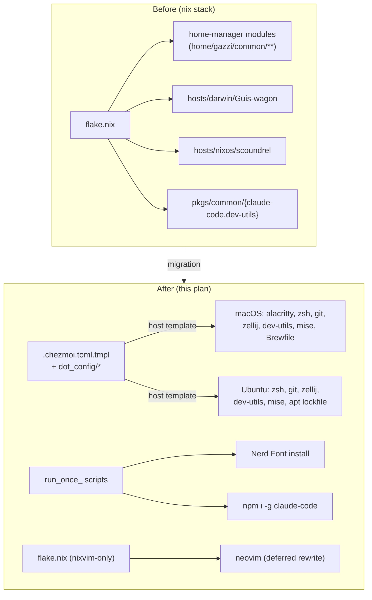

# feat: Migrate dotfiles off nix to chezmoi + Brewfile/apt + mise

## Summary

Migrate this repo from nix-darwin/NixOS/home-manager to chezmoi for dotfile management, Homebrew (Brewfile) for macOS packages, an apt lockfile for Ubuntu packages, and mise for toolchain versions. proto is kept but narrowed to per-project `.prototools` in moonrepo projects only. All nix-darwin/NixOS system modules and the `scoundrel` host are deleted. nixvim's Lua rewrite is deferred to follow-up — a minimal standalone flake survives solely to build neovim in the interim.

---

## Problem Frame

The repo currently manages two machines (a macOS laptop, an Ubuntu host) through a flake-based nix-darwin + NixOS + home-manager stack. For a 2-machine personal setup, the ongoing cost of maintaining nix expressions — flake inputs, module plumbing, custom-built packages — outweighs what it buys. The owner wants a small set of standard, single-purpose tools instead, and wants the dead nix configuration removed rather than left to rot.

This plan covers the mechanical migration and deletion. It does not replace nix-specific system-level conveniences (auto-update timers, declarative bluetooth/printing/locale) — those are dropped outright, per the origin issue (see origin).

---

## Requirements

Traced to the origin issue's user stories (see origin):

- **R1** — Dotfiles applied via chezmoi; no dependency on the nix package manager/evaluator for home-directory files.
- **R2** — Host-specific dotfile variants (macOS vs Ubuntu) from a single chezmoi source tree.
- **R3** — Brewfile tracks macOS packages; `brew bundle` reproduces the package set.
- **R4** — apt lockfile reproduces the Ubuntu package set without nix.
- **R5** — Nerd Font (Fira Code) installed via a chezmoi `run_once_` script.
- **R6** — mise manages language/tool versions globally, one toolchain manager across both machines.
- **R7** — proto retained, scoped to moonrepo projects only, via their own `.prototools`.
- **R8** — No global tool managed simultaneously by both mise and proto.
- **R9** — All unnecessary nix-darwin/NixOS host/module files removed.
- **R10** — Locale/timezone/keymap left to installer defaults or manual config (no replacement built).
- **R11** — Bluetooth/printing handled manually via OS settings (no replacement built).
- **R12** — nix-based auto-update timer removed, no declarative replacement.
- **R13** — `scoundrel` NixOS host configuration removed outright (machine now runs HAOS).
- **R14** — Single verification step (`chezmoi apply --dry-run` / `chezmoi diff`) covers templates, host branching, and the `run_once_` font script before any real apply.

---

## Key Technical Decisions

**Chezmoi source lives in this repo, at the repo root.** The repo becomes the chezmoi source directory directly (`chezmoi init --source .` equivalent) rather than a separate dotfiles-source repo. Keeps one repo, one history, matches the existing single-repo setup.
*Rationale:* no reason to split; chezmoi supports a source repo directly used as `$(chezmoi source-path)`.

**Standalone nixvim flake survives, scoped to neovim only.** nixvim's declarative config (`home/gazzi/common/core/nixvim/`) is a nix DSL with no mechanical chezmoi equivalent — porting it to plain Lua is a real rewrite, deferred to follow-up work per user decision. Until that rewrite lands, a minimal `flake.nix` (home-manager standalone, nixvim input only) stays just to build neovim; everything else — `hosts/`, `modules/`, non-nvim home-manager modules, `pkgs/common/{claude-code,dev-utils}`, `overlays/`, `checks.nix` — is deleted.
*Rationale:* explicit user call-out resolution — full nix teardown except the one component with no cheap replacement.
*Caveat:* six nixvim config files call `lib.custom.nixvim.keymapGroup`/`keymapToggles`, which only exist today because the top-level `flake.nix` extends `nixpkgs.lib` with `lib/` via `nixpkgs.lib.extend` before passing it into home-manager. A naive standalone `homeManagerConfiguration` using the default `lib` argument will fail evaluation with "attribute custom missing." The reduced flake must reproduce that `lib.extend` step (keeping `lib/` — not a candidate for deletion) and pass the extended `lib` via `extraSpecialArgs`, plus define `home.username`/`home.homeDirectory`/`home.stateVersion` directly in a small home module (no more `hostSpec`/platform.nix indirection, since those are deleted). See U9.

**dev-utils and claude-code get non-nix replacements, not deferred.** `pkgs/common/dev-utils` is plain shell scripts with no build step (`lib.mkSubDerivation` just exposes `src/` as-is) — chezmoi copies the directory verbatim (U3). `pkgs/common/claude-code` is an npm-wrapped CLI — replaced by a dedicated `run_once_install-claude-code.sh.tmpl` running `npm install -g @anthropic-ai/claude-code` (U4).
*Rationale:* both have a trivial non-nix equivalent, unlike nixvim; no reason to defer them.

**apt lockfile is a plain package-name list consumed by `apt-get install`.** No dedicated lockfile tool introduced (e.g., no apt-clone/aptdiff dependency) — one file, one line per package, read by a `run_once_` or manual `xargs apt-get install` step.
*Rationale:* issue leaves the exact mechanism open; a flat list is the smallest thing that satisfies "reproducible package set" for one machine.

**Cross-host template verification uses `chezmoi execute-template` with overridden `.chezmoi.toml.tmpl` data, not a second physical machine.** `chezmoi apply --dry-run` only exercises the OS chezmoi is actually running on. To check the *other* host's template branch without owning that machine, render templates via `chezmoi execute-template` against a fabricated data set (`.chezmoi.os` / `.chezmoi.hostname` overridden), reviewed as text output rather than applied.
*Rationale:* satisfies R14's "verify before touching a live machine" for the host not physically at hand; native-host `--dry-run` remains the primary check on each real machine.

---

## Scope Boundaries

### Deferred to Follow-Up Work

- Rewriting `home/gazzi/common/core/nixvim/` as plain Lua (`init.lua` + modules, e.g. via lazy.nvim). Tracked as its own follow-up issue; this plan only isolates it behind a minimal standalone flake.
- Any consolidation of the leftover nixvim-only flake once the Lua rewrite lands (removing `flake.nix`/`flake.lock` entirely is the natural close-out of that follow-up, not this plan).

### Out of Scope (carried from origin)

- Ansible or any system-configuration/orchestration tool.
- Any host beyond the existing macOS laptop and Ubuntu machine.
- Migrating or preserving `scoundrel` — it is deleted, not migrated.
- Declarative bluetooth, printing, ssh hardening, locale/timezone/keymap configuration.
- A replacement for the nix-based auto-update automation.

---

## High-Level Technical Design



---

## Implementation Units

### U1. Chezmoi source bootstrap and host templating

**Goal:** Establish the chezmoi source root and the macOS-vs-Ubuntu templating mechanism everything else builds on.

**Requirements:** R1, R2

**Dependencies:** none

**Files:**
- `.chezmoi.toml.tmpl` (create) — prompts/derives `os` (darwin/ubuntu) at `chezmoi init` time
- `.chezmoiroot` (create, if source lives in a subdirectory rather than repo root — otherwise omit)
- `.chezmoiignore` (create) — excludes this plan doc, `docs/`, leftover nix files during the transition

**Approach:** Use chezmoi's built-in `.chezmoi.os` template variable (`darwin` / `linux`) as the primary branch condition rather than a hand-rolled prompt, falling back to a `.chezmoi.toml.tmpl`-defined variable only where finer distinction is needed (e.g., "linux + this specific Ubuntu host" vs. "any linux").

**Patterns to follow:** none in-repo (first chezmoi usage) — mirror the current `home/gazzi/common/core/{darwin,nixos}.nix` split, i.e., shared config by default, `{{ if eq .chezmoi.os "darwin" }}`-gated blocks for macOS-only pieces (mirroring `home/gazzi/common/core/darwin.nix`'s alacritty import).

**Test scenarios:**
- Rendering `.chezmoi.toml.tmpl` on a macOS destination produces `os = "darwin"`.
- Rendering on a Linux destination produces `os = "linux"` (or the finer Ubuntu variant, per KTD).
- `chezmoi execute-template` against a fabricated Linux data override renders macOS-only blocks as absent.

**Verification:** `chezmoi init --source . --dry-run` completes without template errors on the current (macOS) machine; `chezmoi execute-template` renders a Linux-context sample without errors.

---

### U2. Migrate shell, git, terminal, and multiplexer dotfiles

**Goal:** Port the config currently expressed via home-manager's `programs.zsh`, `programs.git`, `programs.alacritty`, `programs.zellij`, `programs.direnv`, `programs.starship` into plain, chezmoi-managed dotfiles.

**Requirements:** R1, R2

**Dependencies:** U1

**Files:**
- `dot_config/zsh/.zshrc.tmpl` (or equivalent chezmoi-managed path) — aliases (`home/gazzi/common/core/zsh/shortcuts.nix`), completion tuning (`home/gazzi/common/core/zsh/completion.nix`), nix-sourcing block dropped (no longer relevant)
- `dot_gitconfig.tmpl` — aliases, delta, LFS, user identity (from `home/gazzi/common/core/git/default.nix`)
- `private_dot_local/libexec/dev-utils/git-clean-branches` (create) — verbatim copy of `home/gazzi/common/core/git/commands/bin/git-clean-branches` (currently installed via a nix `buildEnv` alongside `lazygit`; ports as a plain script next to U3's dev-utils, since it has the same "no build step" shape)
- `dot_config/alacritty/alacritty.toml.tmpl` — macOS-only (`{{ if eq .chezmoi.os "darwin" }}`), padding/colors/font settings (from `home/gazzi/common/core/darwin/alacritty/default.nix` and `colour-theme-nord.nix`)
- `dot_config/zellij/config.kdl`, `dot_config/zellij/themes/*.kdl`, `dot_config/zellij/layouts/*.kdl` — direct copies, no templating needed (from `home/gazzi/common/core/zellij/`)
- `dot_config/direnv/direnvrc` or zshrc direnv-hook line — replaces `programs.direnv` home-manager wiring
- `dot_config/starship.toml` — replaces `programs.starship.settings` (from `home/gazzi/common/core/zsh/default.nix`)
- `dot_config/zsh/.zshrc.tmpl` (modify) — `export WORKSPACE="$HOME/workspace"`, replacing `home.sessionVariables.WORKSPACE` from `home/gazzi/common/core/dev.nix`; dev-utils' `pj/*` and `gh/open` scripts (ported in U3) read `$WORKSPACE` directly and fail without it

**Approach:** Home-manager's `programs.X.enable` blocks mostly expand to plain config-file syntax the underlying tool already understands (starship TOML, zellij KDL, git INI, alacritty TOML) — this is direct value transcription, not a redesign. zsh gets one `.zshrc` assembled from the pieces currently split across `default.nix`/`shortcuts.nix`/`completion.nix`, since chezmoi has no equivalent to home-manager's `initContent` ordering.

**Patterns to follow:** existing nix files listed above are the source of truth for values (aliases, colors, settings) — transcribe values, not nix syntax.

**Test scenarios:**
- `chezmoi diff` shows the assembled `.zshrc` containing all aliases from `shortcuts.nix` and the completion options from `completion.nix`.
- macOS destination: `chezmoi diff` includes `alacritty.toml`; Linux destination: it is absent.
- git aliases and `delta.enable`-equivalent config land in `.gitconfig` and match current alias definitions.
- zellij theme/layout files are byte-identical to the current KDL sources (no templating needed, so no drift).
- `direnv` hooks into the shell: opening a directory with an `.envrc` triggers the direnv prompt/load in a fresh shell sourcing the ported `.zshrc.tmpl` (execution-time check, noted as deferred to implementation like U3's PATH check).
- `$WORKSPACE` is set and non-empty in a fresh shell sourcing `.zshrc.tmpl`, matching the current default from `dev.nix`'s `ggazzi.dev.workspace` option.

**Verification:** `chezmoi apply --dry-run` on the current macOS machine shows only expected file creates for this unit, no template errors.

---

### U3. Migrate dev-utils as plain chezmoi-managed files

**Goal:** Move the `dev` CLI (currently `pkgs/common/dev-utils`, exposed via `lib.mkSubDerivation`) to chezmoi-managed files with no build step, plus PATH/completion wiring.

**Requirements:** R1

**Dependencies:** U2 (shares the `.zshrc` this unit appends to)

**Files:**
- `private_dot_local/libexec/dev-utils/**` (create) — verbatim copy of `pkgs/common/dev-utils/src/**` (libexec scripts, `lib/interactive.sh`, prompt templates)
- `dot_config/zsh/.zshrc.tmpl` (modify) — add PATH entry and completions sourcing (replacing the `.nix-profile/opt/dev-utils/completions.zsh` line from `home/gazzi/common/core/dev.nix`)

**Approach:** `pkgs/common/dev-utils/package.nix` uses `lib.mkSubDerivation` purely to expose `src/` on `$PATH` under a `dev` dispatcher (the `sub` tool pattern) — no compilation happens. Chezmoi's `executable_` file-attribute prefix preserves the executable bit on the `libexec/*` scripts during copy.

**Patterns to follow:** `pkgs/common/dev-utils/src/` directory layout stays unchanged; only the packaging mechanism changes.

**Test scenarios:**
- `chezmoi diff` shows all files under `pkgs/common/dev-utils/src/` present at the new destination path with matching content.
- Executable scripts (`libexec/*/start`, `libexec/*/open`, etc.) retain executable permission bits after `chezmoi apply --dry-run` (verified via chezmoi's reported file mode, not just presence).
- `.zshrc` PATH includes the new `dev-utils` location and the `dev` dispatcher resolves on `$PATH` after a real apply (execution-time check, noted as deferred to implementation).

**Verification:** `chezmoi apply --dry-run` reports no diff between `pkgs/common/dev-utils/src` and the rendered destination content.

---

### U4. Nerd Font install via `run_once_` script

**Goal:** Install the patched Fira Code Nerd Font (icon glyphs) on machines where it isn't available as a packaged apt/brew asset with the icon patches.

**Requirements:** R5

**Dependencies:** U1

**Files:**
- `run_once_install-nerd-font.sh.tmpl` (create) — downloads the Fira Code Nerd Font release archive, unzips into the OS-appropriate font directory, runs `fc-cache -f` on Linux (macOS font registration is automatic on file placement)
- `run_once_install-claude-code.sh.tmpl` (create) — `npm install -g @anthropic-ai/claude-code`, replacing `pkgs/common/claude-code`'s nix build (see KTD); owned here rather than the Brewfile since it's an npm-managed CLI, not a brew formula

**Approach:** Font script branches on `.chezmoi.os` for the install path (`~/Library/Fonts` on darwin, `~/.local/share/fonts` on Linux) and the cache-refresh step (`fc-cache -f`, Linux-only — macOS doesn't need it). `run_once_` naming ensures chezmoi only re-runs each script when its content changes, not on every apply. The claude-code script is unconditional (both OSes have npm via mise/nvm, established elsewhere in this plan).

**Technical design:**
```
if darwin: dest = ~/Library/Fonts
else:      dest = ~/.local/share/fonts; mkdir -p
download FiraCode.zip from the Nerd Fonts release
unzip into dest, excluding non-ttf/otf files
if linux: fc-cache -f
```
(Directional — exact release URL/version pinning is an implementation-time detail.)

**Patterns to follow:** none in-repo; this replaces `hosts/common/optional/gnome.nix`'s `fonts.packages = [ pkgs.nerd-fonts.fira-code ]` and the macOS `home.packages` font entry in `home/gazzi/common/core/darwin/alacritty/default.nix`.

**Test scenarios:**
- Script is idempotent: running it twice does not re-download/re-unzip when the font is already present at the expected version (checked via a marker file or font-file existence check).
- On a fresh destination, the script creates the destination directory if absent (Linux case) before unzipping.
- Script content-hash changing (e.g., version bump) causes chezmoi to re-run it on the next apply (this is `run_once_`'s built-in behavior — verify by editing the script and re-running `chezmoi apply --dry-run`, expecting it listed as a pending run).

**Verification:** `chezmoi apply --dry-run` lists the `run_once_` script as would-run on first apply; a second `--dry-run` after a real apply shows it as already-run (no-op).

---

### U5. Brewfile for macOS packages

**Goal:** Track all current macOS packages in a `Brewfile` so `brew bundle` reproduces the package set.

**Requirements:** R3

**Dependencies:** none (can proceed in parallel with U1-U4)

**Files:**
- `Brewfile` (create, at chezmoi source root or a `dot_config`-adjacent location applied via `run_once_`)

**Approach:** Enumerate packages from two sources, not just explicit `home.packages`/`environment.systemPackages` lists — home-manager's `programs.X.enable = true` blocks implicitly install their underlying package too, and those are easy to miss since nothing in the plan's other units names them as packages. Direct-list source: `hosts/common/core/default.nix` (curl, gitAndTools.gitFull, htop, openssh, ripgrep, vim, wget), `home/gazzi/common/core/dev.nix` (gh, fzf, jq — dev-utils itself moves per U3), `home/gazzi/common/core/darwin/alacritty/default.nix` (alacritty, nerd-fonts.fira-code — font now covered by U4's script instead). Implicit-via-`programs.enable` source: `git-delta` (from `programs.git.delta.enable`), `zellij`, `starship`, `direnv`, plus `lazygit` and `ruby` (from `home/gazzi/common/core/git/default.nix`'s custom `home.packages` buildEnv — ruby is `git-clean-branches`' runtime, ported as a script in U2, but still needs its interpreter installed). Add `proto` (the binary U8 depends on, not U8's global activation) and, on macOS, `git-delta`/`lazygit`/`ruby` here rather than leaving them to be rediscovered at apply time. Casks for GUI apps already installed via Homebrew directly are out of scope for this enumeration (not currently declared in nix, since `homebrew.enable = true` in `hosts/common/users/primary/darwin.nix` already delegates cask management to Homebrew) — add them to the Brewfile from `brew bundle dump` at implementation time, not from this plan's nix-derived list.

**Patterns to follow:** standard `Brewfile` syntax (`brew "pkg"`, `cask "app"`, `tap "org/repo"`).

**Test scenarios:**
- `brew bundle check --file=Brewfile` reports no missing formulae after the file is populated from the current package list (run against the actual dev machine, per origin's testing decision — not an automated test).
- Every formula name maps 1:1 to a package currently installed via nix `home.packages`/`environment.systemPackages` on the darwin host (manual cross-check against the file lists above), so nothing silently drops.

**Verification:** `brew bundle check --file=Brewfile` passes on the current macOS machine (manual verification per origin's testing decision).

---

### U6. apt lockfile for Ubuntu packages

**Goal:** Reproduce the Ubuntu package set without nix, via a plain package list.

**Requirements:** R4

**Dependencies:** none

**Files:**
- `apt-packages.txt` (create) — one package name per line
- `run_once_install-apt-packages.sh.tmpl` (create) — Linux-only (`{{ if eq .chezmoi.os "linux" }}`), reads the list and runs `apt-get install -y $(cat apt-packages.txt)`

**Approach:** Per KTD, no dedicated lockfile tool — flat list consumed by a `run_once_` script gated to Linux. Seed the list from `hosts/common/core/nixos.nix`/`environment.systemPackages` equivalents, the same implicit-via-`programs.enable` set called out in U5 (`git-delta`, `zellij`, `starship`, `direnv`, `lazygit`, `ruby`, `proto`), and any Nerd Font apt package noted in the origin (plain `fonts-firacode`, called out as insufficient — the patched variant stays with U4's script, not this list).

**Patterns to follow:** none in-repo; mirrors U4's `run_once_` OS-gating pattern.

**Test scenarios:**
- Script only registers as pending on a Linux destination (`chezmoi execute-template` with darwin data shows the script producing no action / being skipped).
- `apt-packages.txt` contains no package also covered by U4's dedicated font script (avoids double-managing the font).

**Verification:** Real application on the Ubuntu machine installs the listed packages without error (manual, per origin's testing decision — no automated apt seam introduced for a package list).

---

### U7. mise global toolchain configuration

**Goal:** Replace nix + asdf-vm as the global dev-toolchain version manager with mise.

**Requirements:** R6, R8

**Dependencies:** U2 (mise activation line goes into the same `.zshrc.tmpl`)

**Files:**
- `dot_config/mise/config.toml` (create) — global tool version pins
- `dot_config/zsh/.zshrc.tmpl` (modify) — `eval "$(mise activate zsh)"`, replacing `home/gazzi/common/core/asdf.nix`'s asdf-vm sourcing line

**Approach:** mise is asdf-plugin-compatible, so any tool without a native mise backend falls back to its asdf plugin — no gap in coverage versus the current asdf-vm setup. Global config replaces `asdf.nix`'s `home.packages = [ asdf-vm ]` plus whatever `.tool-versions`/asdf plugin config exists outside this migration's visibility (not found in the scanned nix tree — likely managed per-project already, outside nix).

**Patterns to follow:** none in-repo (first mise usage); `home/gazzi/common/core/asdf.nix` is the direct predecessor being replaced.

**Test scenarios:**
- `mise doctor` reports no configuration errors after `config.toml` is applied.
- A tool version pinned in `config.toml` resolves via `mise which <tool>` to the mise-managed shim, not a system-installed binary.
- No tool listed in `config.toml` also appears as a globally-activated proto tool — U8 removes proto's global shell activation entirely, so this reduces to confirming `.zshrc.tmpl` carries no `proto activate` line (enforces R8 — cross-checked against U8's output, not a separate automated test).

**Verification:** `mise doctor` and `mise ls` show expected tools/versions after a real apply on each machine (manual, per origin's testing decision for toolchain state).

---

### U8. Rescope proto to per-project moonrepo use

**Goal:** Remove proto's global shell activation; leave proto usable only within moonrepo (`moon`) projects via their own `.prototools`.

**Requirements:** R7, R8

**Dependencies:** U7 (must confirm no global-tool overlap before finalizing either)

**Files:**
- `home/gazzi/common/core/proto.nix` — deleted (see U9; this unit identifies the removal, U9 executes repo-wide deletion sweep)
- `README.md` or a short note (create/modify) — documents that proto is intentionally *not* globally activated; moon projects drive it per-project via `.prototools`

**Approach:** No chezmoi-managed global proto activation is created (unlike mise in U7) — this is a deliberate absence, not an oversight. moon invokes proto internally per-project, so the `proto` binary must still be on `$PATH`; it becomes a Brewfile/apt-lockfile entry (U5/U6 — already listed there) rather than a shell-activated global tool.

**Patterns to follow:** `home/gazzi/common/core/proto.nix`'s current shell-activation block is the thing being removed, not ported.

**Test scenarios:**
- `.zshrc.tmpl` (from U2/U7) contains no `proto activate` line and no `$HOME/.proto/bin` PATH prepend.
- `proto` binary is present via Brewfile/apt-lockfile (installable independent of shell activation), satisfying moon's internal invocation needs.

**Test expectation:** the "no global activation" behavior is verified by absence in `chezmoi diff` output for `.zshrc.tmpl` — no separate runtime test needed beyond U7's mise checks confirming no naming/PATH collision.

**Verification:** `chezmoi diff` for the shell rc file shows no proto-activation lines; Brewfile/apt lockfile lists `proto` as an installed binary.

---

### U9. Delete nix-darwin/NixOS system modules and the `scoundrel` host

**Goal:** Remove the nix system-configuration surface named in the origin issue, plus the now-fully-migrated home-manager modules.

**Requirements:** R9, R10, R11, R12, R13

**Dependencies:** U1-U8 (deletion happens only once each module's content has a chezmoi/Brewfile/apt/mise home, or is confirmed dropped per Scope Boundaries)

**Files (delete):**
- `hosts/common/core/darwin.nix`, `hosts/common/core/nixos.nix`
- `hosts/nixos/scoundrel/` (entire directory)
- `hosts/darwin/Guis-wagon/default.nix`
- `hosts/common/optional/audio.nix`, `hosts/common/optional/bluetooth.nix`, `hosts/common/optional/gnome.nix`
- `hosts/common/optional/services/openssh.nix`, `hosts/common/optional/services/printing.nix` (if present under this path)
- `modules/hosts/common/auto-update.nix`
- `hosts/common/users/primary/darwin.nix`, `hosts/common/users/primary/nixos.nix` (both confirmed present in the repo during planning)
- `home/gazzi/scoundrel.nix`
- `pkgs/common/claude-code/` (replaced by U4/U5's npm-install step)
- `pkgs/common/dev-utils/` (content relocated in U3)
- `home/gazzi/common/core/asdf.nix` (replaced by U7)
- `home/gazzi/common/core/proto.nix` (per U8)
- `home/gazzi/common/core/{zsh,git,zellij,dev.nix,claude.nix,darwin.nix,nixos.nix,default.nix}` and `home/gazzi/common/core/darwin/alacritty/` (content ported in U2/U3; nix wrapper deleted)
- `home/gazzi/common/optional/` (zed, golang — evaluate at implementation time whether zed settings move to chezmoi as plain JSON copies, same pattern as U2, or are dropped as out-of-scope; not named in the origin issue's user stories, so treat as a small U2-style follow-on rather than a separate unit)
- `home/gazzi/Guis-wagon.nix`
- `hosts/common/core/default.nix`, `hosts/common/users/primary/default.nix` (reduced to whatever U-what-survives needs, likely deleted outright since nothing in this plan still needs system-level nix modules)

**Files (keep, reduced):**
- `flake.nix` — rewritten to a minimal standalone home-manager flake building only nixvim (per KTD's caveat): retains the `nixpkgs.lib.extend` step wiring `lib/` in as `lib.custom`, passes it via `extraSpecialArgs`, and defines a small home module setting `home.username`/`home.homeDirectory`/`home.stateVersion` directly (no `hostSpec` indirection) importing only `home/gazzi/common/core/nixvim`; all `nixosConfigurations`/`darwinConfigurations`/host-module wiring removed
- `flake.lock` — regenerated after `flake.nix` is reduced
- `home/gazzi/common/core/nixvim/` — untouched (deferred rewrite)
- `lib/` — kept; the reduced flake's `lib.custom.nixvim.keymapGroup`/`keymapToggles` extension depends on it (see KTD caveat)
- `overlays/`, `checks.nix` — deleted; the nixvim-only flake has no overlay or pre-commit-check dependency

**Approach:** This is a deletion sweep, sequenced last so every deleted file's content has already landed in chezmoi/Brewfile/apt-lockfile/mise (U1-U8) or is a confirmed no-replacement drop (R10-R12, Scope Boundaries). `justfile` and `shell.nix` are evaluated at implementation time — likely deleted alongside the flake reduction since they exist to drive the now-removed `just update apply` workflow, unless something in the nixvim-only flake still needs them.

**Patterns to follow:** none — pure deletion, guided by the origin issue's explicit file list plus this plan's U1-U8 coverage.

**Test scenarios:**
- After deletion, `nix flake check` (or equivalent) on the reduced `flake.nix` succeeds, proving the nixvim-only flake is self-contained and doesn't dangle a reference to a deleted module.
- `git grep` for each deleted path's basename across the remaining repo returns no stale references (no leftover imports pointing at deleted files).

**Verification:** Reduced `flake.nix` builds successfully (`nix build .#homeConfigurations.<name>.activationPackage` or equivalent for a standalone home-manager nvim-only config); no broken imports remain.

---

### U10. Cross-host chezmoi verification pass

**Goal:** Provide the single verification step (R14) that exercises template rendering, host branching, and the `run_once_` scripts for both host contexts before any real `chezmoi apply` on a live machine.

**Requirements:** R14

**Dependencies:** U1-U8 (verifies their combined output)

**Files:**
- `README.md` (modify) — documents the verification commands as the standard pre-apply check

**Approach:** Two-layer check per KTD: (1) `chezmoi apply --dry-run` (equivalently `chezmoi diff`) on whichever machine is running it, exercising that machine's real OS branch end-to-end including `run_once_` script pending-state; (2) `chezmoi execute-template` against fabricated `.chezmoi.os`-overridden data to review the *other* host's template output as text, without a physical second machine.

**Test scenarios:**
- Covers R2: `chezmoi diff` on macOS includes alacritty config and excludes the apt-lockfile `run_once_` script; the fabricated-Linux `execute-template` render shows the reverse.
- Covers R5/R14: both host contexts' `run_once_` font script renders with the correct OS-specific install path (darwin vs. Linux font directory) with no execution needed to check the branch.
- Covers R14: full dry-run on the native machine surfaces zero unexpected file changes outside what U1-U8 introduced (no accidental deletion or overwrite of files chezmoi doesn't manage).

**Verification:** `chezmoi apply --dry-run` and the fabricated-context `chezmoi execute-template` pass cleanly are the acceptance bar for the whole migration before a real `chezmoi apply` is run against either live machine.

---

## Sources & Research

Local repo inspection only (`home/`, `hosts/`, `modules/`, `pkgs/`, `flake.nix`) — no external research dispatched. chezmoi, mise, Homebrew Bundle, and apt are stable, widely-documented tools; the origin issue already made the tool-selection decisions, so this plan applied direct tool knowledge rather than a landscape scan. No local chezmoi/mise usage exists yet in this repo (first adoption), so implementation-time conventions (exact `run_once_` scripting idioms, `.chezmoi.toml.tmpl` prompt style) should be checked against current chezmoi docs during U1 if behavior differs from what's assumed here.
